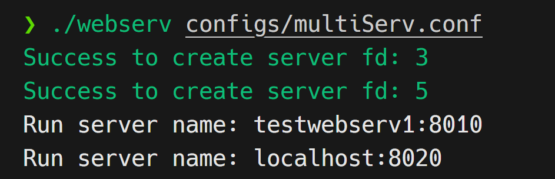

# Webserv
> This project is about writing your own HTTP server. The program work kind of web server with CGI handler and take one argument as a configuration file. The server must be non-blocking and take only 3 method GET, POST, and DELETE.

---
## ⚙️Configuration Files
### Directive of Configuration file must have
|Directive|Description|Example|
|---|---|---|
|`listen`|set IP addr and port number|listen 80;|
|`server_name`|set Domain name|server_name webserver.42.fr;|
|`error_page`|set path of error page|error_page 500 502 503 504 /50x.html;|
|`client_max_body_size`|Max size body request in byte|client_max_body_size 8000;|
|`location`|path name that match with URL|location / { # another config ...}|
|`limit_except`|listed allowed method|limit_except GET;|
|`return`|redirection URI|return 200 "Hello I'm Prach mannnn!";|
|`root`|route path on server side|root docs/myPage/;|
|`autoindex`|directory listing|autoindex on;|
|`index`|set default files|index index.html index.htm;|
|`cgi_pass`|set CGI execute|cgi_pass on;|

---
## 📝Usage
### 1. Set configuration file
You can set configuration file as you desire. We have defaulted files in `configs` directory.

### 2. Compilation
To compile the program, run `make` on **webserv** directory.

```bash
$ make
```
### 3. Execution
The program takes 1 argument (config file) to execute:

```bash
$ ./webserv configs/multiServ.conf
```

The program will display domain and port that are listening

You can access web pages on browser via URIs
localhost:8010
localhost:8020